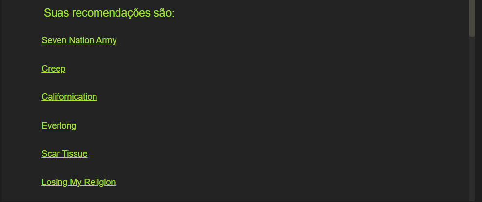

# Grafos1_SongRecommendation

**Número da Lista**: 1 
**Conteúdo da Disciplina**: Grafos 1 

## Alunos
|Matrícula | Aluno |
| -- | -- |
| 17/0017885  | Marcos Nery Borges Júnior |
| 14/0160205  |  Ramon Silva Sales |

## Sobre 
Este projeto tem como objetivos recomendar ao usuário músicas que ele possa gostar, tendo como base similaridades que essas músicas tem com uma música qualquer que o usuário forneça de entrada.

A forma pela qual isso é atingido é a construção de um grafo que relaciona músicas a suas categorias. Após isso, o programa acha as músicas com mais relações em comum com a música que o usuário forneceu.

Isso se baseia no principio de que se uma pessoa gosta de uma música, tem grandes chances de gostar de uma outra que se enquadre em grande parte das mesmas categorias/sub-categorias.

## Screenshots
### Jupyter notebook

### Frontend

## Instalação 
**Linguagem**: Python >= 3.8  
**Framework**: Flask   

O projeto está disposto em duas formas diferentes. Uma é pelo Jupyter notebook, que tem todo o código completo e explica cada uma das etapas. Essa é a parte principal do projeto
Para executar/visualizar o notebook basta instalar o jupyter notebook na sua maquina através das instruções dispostas na seção "Getting started with the classic Jupyter Notebook" [aqui](https://jupyter.org/install). [Você também pode executar o jupyter notebook através do navegador](https://mybinder.org/v2/gh/ipython/ipython-in-depth/master?filepath=binder/Index.ipynb) (não recomendado) ou utilizar o docker, seguindo as instruções mais abaixo.

Se desejar apenas visualizar o jupyter notebook, basta ver o arquivo (songs_recommendation.ipynb)[https://github.com/projeto-de-algoritmos/Grafos1_SongRecommendation/blob/master/songs_recommendation.ipynb] pelo próprio GitHub.

A outra frente do projeto é um frontend, pelo qual você também pode utilizar a aplicação, trocando a didática do jupyter pelo conforto de ter um design. Para executar essa frente, caso não tenha docker, basta instalar o micro-framework [Flask](https://flask.palletsprojects.com/en/1.1.x/installation/) e em seguida executar o seguinte comando:

`pip install -r requirements.txt && python web/app.py`

## Instalação com Docker

Se você tiver docker na sua máquina tudo fica mais fácil. Basta executar o comando `docker-compose up` e dois ambientes estarão em funcionamento.
  
  * Para acessar o jupyter notebook basta ir até http://localhost:8888/
  * Para acessar o frontend basta ir até http://localhost:5000/

## Observação:
Como dito anteriormente, a frente principal do código está no jupyter notebook, onde todas as etapas estão descritas. O frontend é só para dar uma interface mais amigável para a aplicação.

